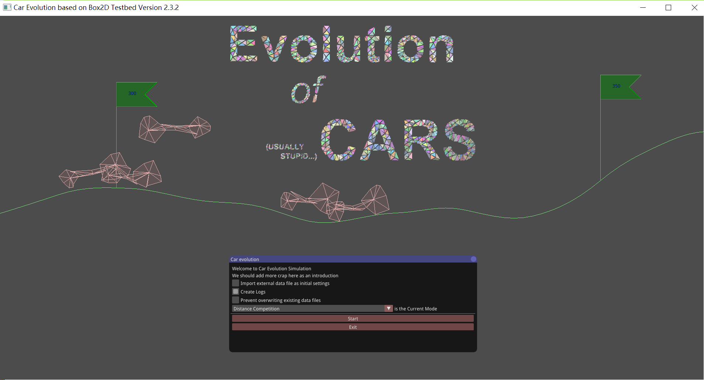

# Evolution of Cars
---

**Evolution of Cars** is a Box2D-based physical simulation of the evolution of the shape and mass distribution of a car. Inspired by the popular game *Hill Climb Racing*, we aim to find the optimal structure of a car in various scenarios, including distance competition, speeding competition, hill climbing, as well as less realistic occasions such as jumping competition and "fancy mode". To achieve the aforementioned goal, we use Box2D as our physics engine, providing data with which the "fitness" of each car can be evaluated, a score indicating how well it is adapting to the specified scenario. The "fitness" scores are then used as a criterion for the genetic algorithm, which computes the best cars through cycles of selection, procreation (crossover), and mutation. 

Typically, a genetic algorithm in such a high-dimension solution space takes hundreds (if not thousands) of cycles to converge to a desirable result. Due to massive computation in physics engine and graphic interface, such a process can take hours. In reality, we recommend the user to switch off graphic interface in order to speed up calculation, and switch it on to check the results an hour later. As an alternative, we have provided some sample results in the `import_data` folder, which can be directly imported and displayed. Hence, it is more preferable to take a peek of what is going on by loading these files first.

Six modes have been provided:

+ distance mode: cars survive by climb mountains and cover as much distance as possible.
+ speeding mode: only cars that can traverse a plain quickly will prevail.
+ fancy mode: cars earn scores by doing fancy tricks.
+ jumping mode: cars get credits by jumping as high as possible.
+ hill climbing mode: cars challenge a great mountain in the shape of exponential curve.
+ off-road racing: only cars that can maintain considerable speed on rugged terrain can prevail.

## Installation: Getting Started
These instructions will get you a copy of the project up and running on your local machine for development and testing purposes. Currently we support Visual Studio on Windows 10 and Xcode on MacOS by generating solution files with premake5. We appreciate contributions to get premake working on other platforms.

### Prerequisites

#### Hardware

+ There are no special requirements. As reference, one of the team members developed the project with Intel® Core™ i5-4200U Processor, 4.0GB DDR3 memory, and Intel® HD Graphics Family as GPU.
+ The recommended screen resolution is 1920*1080, although lower resolutions are also acceptable.

####Software

+ Either Visual Studio on Windows 10 (with Windows SDK version 10.0 or above) or Xcode on MacOS
+ Gmake is not supported yet.
+ please download `premake5` from [the official website](https://premake.github.io/).

###Building Solution 

#### Visual Studio on Windows 10

+ Command line: `premake5 vs2017`
+ Open the resulting solution file `CarEvolution.sln` in Build/vs2017
+ Set Evolution as the startup project
+ Select all projects and change the SDK version from 8.1 (default) to your current SDK version 
+ Edit properties for project Evolution
  + Go to the "Configuration Properties -> C/C++ -> *Precompiled Headers*" section, then change the "Precompiled Header" setting to "Not Using Precompiled Headers" option.
  + Go to the "Configuration Properties -> C/C++ -> *General*" section, then add `../..` to *Additional Include Directories*.
+ Change Building Configuration from *Debug* to *Release*

#### xcode on MacOS

+ Command line: `premake xcode4`
+ Open the resulting project file `CarEvolution.xcworkspace` in Build/xcode4
+ Set Evolution as the current scheme
+ Edit properties for scheme Evolution
  + Go to "Building settings"  and Change "C++ Language Dialect" to "C++11 [-std=c++11]".
  + Go to "Edit Scheme -> Run -> Build Configuration" and change the  configuration from *Debug* to *Release*
+ Go to "project settings" change "iOS Deployment Target" to one that is compatible to your PC (the default setting may be beyond the version on your PC)

### Running the tests

+ Run in *Release* mode and you should be welcomed by something like this:
+ 
+ The cars running in the background are already ample evidence that the project is up and running normally.
+ Optional test
  + Check "Import external data as initial setting" and load one of the following data files
    + `best_10_distance_0.inidat`, `best_10_distance_1.inidat`, `best_10_distance_2.inidat`, or `best_10_distance_3.inidat` for distance mode.
    + `best_10_speed.inidat` for speeding mode.
    + `best_10_jump_0.inidat`, `best_10_jump_1.inidat` or `best_10_jump_2.inidat` for jumping mode.
    + `best_10_fancy_0.inidat` or `best_10_fancy_1.inidat` for fancy mode.
    + `best_10_climb.inidat` for hill climbing mode.
    + `best_10_rock_and_roll_0.inidat` or `best_10_rock_and_roll_0.inidat` for off-road racing.
  + After pressing enter, you will be notified whether your file has been loaded successfully.
  + Select the corresponding mode to be the Current mode.
  + Press "start" to enjoy a fantastic show.

## Basic Usage: Commencing the Evolution

+ Instead of loading existing data files, you can also watch the whole process of how random cars (basically the combination of two random polygons as wheels and one as body) evolve into "good" cars, which is the core purpose of this project.
+ After pressing the "start" button in the main screen, you should see something like this:
+ 
+ As you can see, fifty random cars have been created and shown on the main screen. As they embark on a journey of racing, their fitness will be evaluated and modifications will be made accordingly.
+ You can zoom in or out by scrolling up or down.
+ You can also zoom in/out by pressing `x`/`z`
+ There is also a control panel on the right, with usages as follows:
  + Set gravity: modify the acceleration due to gravity in the simulated world
  + Gravity storm: invoke an anomaly that involves random alteration of gravity from time to time.
  + Change terrain: use a "new map" for next round of simulation. (unchecked by default)
  + Constantly: change terrain for every round of simulation (unchecked by default)
  + Show flags: display the green flags indicating the distance from origin (checked by default)
  + Show detailed info: if checked, detailed information regarding the scenario and each car will be display on the left side of the screen.
  + Fix camera on the first car: the camera will follow the rightmost car (checked by default)
    + if you uncheck this box, you will be able to move the camera will arrow keys.
    + to achieve coarse or fine adjustment of camera positioning, press `Shift` or `Ctrl` respectively.
  + Hz: adjust the rate of simulation. Reducing this value results in fast simulation and coarse results.
  + Press `p` to pause simulation
  + Press `o` to run step by step (provided that the simulation has been paused)
  + Press `r` to start over the whole thing (creating random cars and terrain)
  + Press `Esc` to exit
+ You can also speed up calculation by pressing `Caps Lock` to disable graphic display completely!
+ An accompanying command line window displaying the overall data for every round will be created.
  + **DO NOT** click any part of it, or it will stop refreshing.

## Principal Contributors

- Yu Qiwei (俞启威), School of Physics, Peking University
- Wang Jingxian (王竞先), School of Physics, Peking University
- Wang Qiuyuan (王秋原), School of Physics, Peking University

## Acknowledgements

+ Erin Catto, who developed Box2D. The `Testbed` included in Box2D offers a large set of tools that acts a solid foundation to work on.
+ Rafael Matsunaga, whose project  [Box2D Genetic Car](http://rednuht.org/genetic_cars_2/) is truly inspiration.
+ Wang Qipan, who generously lent us his macbook air for cross-platform tests.